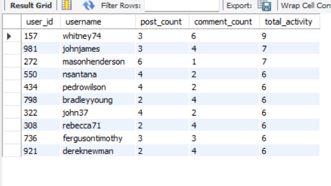
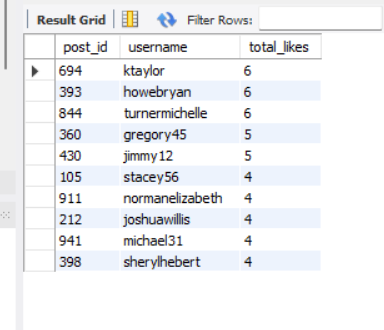
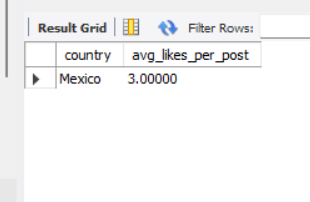
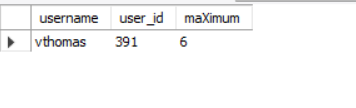
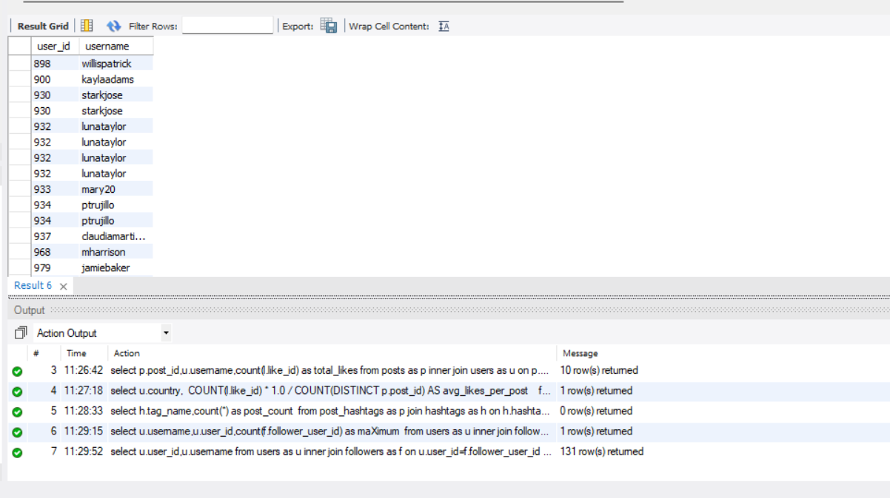
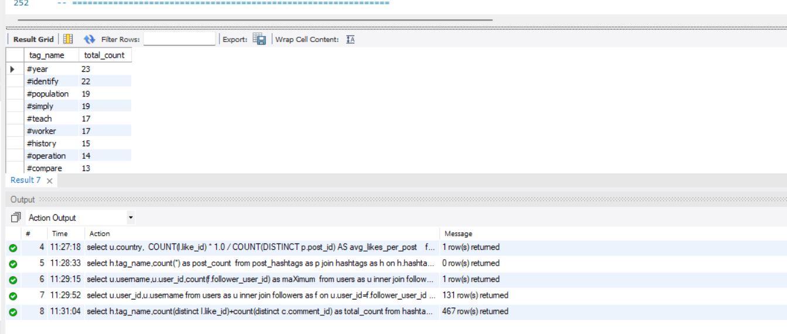
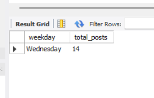
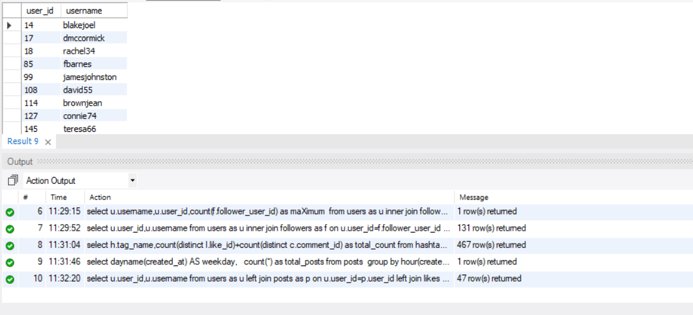
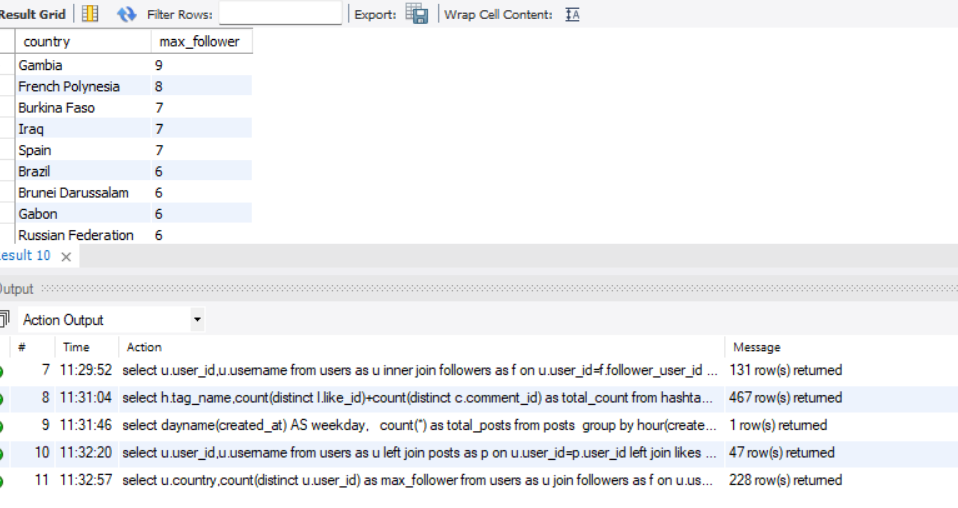

# Social Media Analytics using MySQL

## Project Overview

This project focuses on analyzing a social media platform dataset using **MySQL**. 
It demonstrates the use of SQL to extract meaningful business insights from relational data involving users, posts, likes, comments, followers, and hashtags.

The project solves real-world analytical problems such as identifying active users, trending hashtags, influencer rankings, engagement analysis, 
and user activity reporting.

---

##  Objectives

- Analyze user engagement and social media activity.
- Practice writing advanced SQL queries.
- Perform business-driven data analysis.
- Generate actionable insights from relational databases.

---

##  Tech Stack

- **Database:** MySQL
- **Language:** SQL
- **Tools:** MySQL Workbench 

---

##  Database Schema

The project consists of the following tables:

- Users
- Posts
- Comments
- Likes
- Followers
- Hashtags
- Post_Hashtags

### Relationships

- One User → Many Posts
- One Post → Many Likes
- One Post → Many Comments
- Users can Follow Other Users
- Posts can contain Multiple Hashtags

---

##  Project Tasks

### 1. Most Active Users
- Identified the top 10 users based on combined posts and comments.

 
### 2. Most Liked Posts
- Retrieved the posts with the highest number of likes along with their creators.

### 3. Top Countries by Engagement
- Calculated average likes per post for each country.

### 4. Trending Hashtags
- Identified hashtags used in more than 20 posts.

### 5. Top Influencers
- Ranked users based on follower count.

### 6. Followers Who Never Interacted
- Found users who follow others but never liked or commented.

### 7. Highest Engagement Hashtags
- Calculated total engagement (Likes + Comments) for each hashtag.

### 8. Busiest Posting Time
- Identified the day/hour with the highest posting activity.

### 9. Inactive Users
- Retrieved users who never posted, liked, or commented.

### 10. Top Countries with Most Influencers
- Ranked countries based on the number of highly followed users.

---

##  SQL Concepts Used

- SELECT
- WHERE
- ORDER BY
- GROUP BY
- HAVING
- INNER JOIN
- LEFT JOIN
- Aggregate Functions
- COUNT()
- DISTINCT
- LIMIT
- Self Join
- Many-to-Many Relationships

---

##  Key Business Insights

- Identified the platform's most active users.
- Measured user engagement through likes and comments.
- Discovered trending hashtags.
- Ranked influencers based on follower count.
- Identified inactive users.
- Analyzed country-wise engagement.
- Determined peak posting periods.
- Evaluated hashtag performance.

---

##  Skills Demonstrated

- SQL Query Writing
- Data Analysis
- Relational Database Management
- Business Intelligence
- Data Aggregation
- Joins and Relationships
- Social Media Analytics
- Problem Solving

---

## Sample Analysis

The project includes SQL queries for:

- Active User Analysis
- Influencer Ranking
- Engagement Analysis
- Hashtag Analysis
- Country-wise Analytics
- User Activity Reporting

---

##  Learning Outcomes

Through this project, I learned how to:

- Write optimized SQL queries.
- Work with relational databases.
- Solve real-world business problems using SQL.
- Analyze user behavior and engagement.
- Generate meaningful insights from structured data.

---

 
##  Author

**Sankati Akhil Reddy**

 
 
